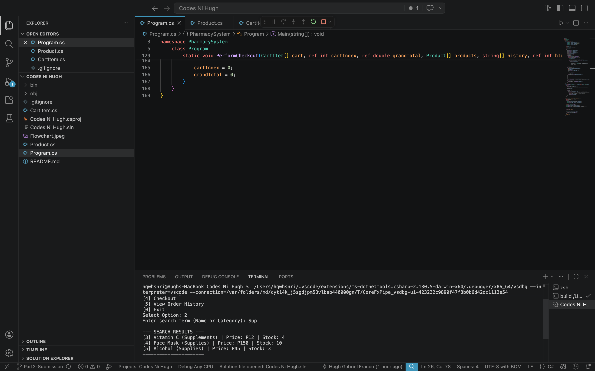
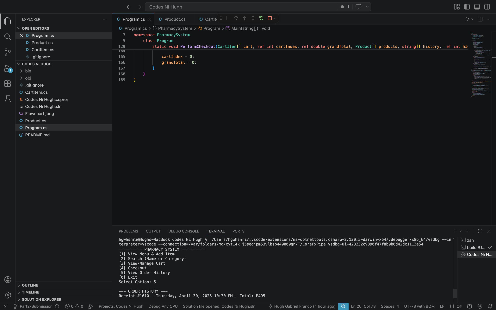
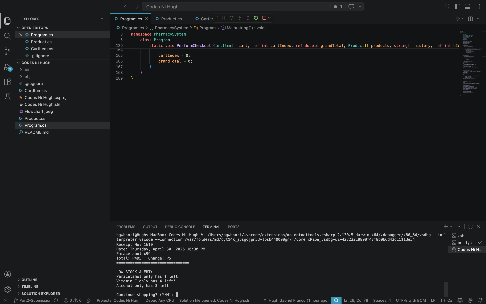
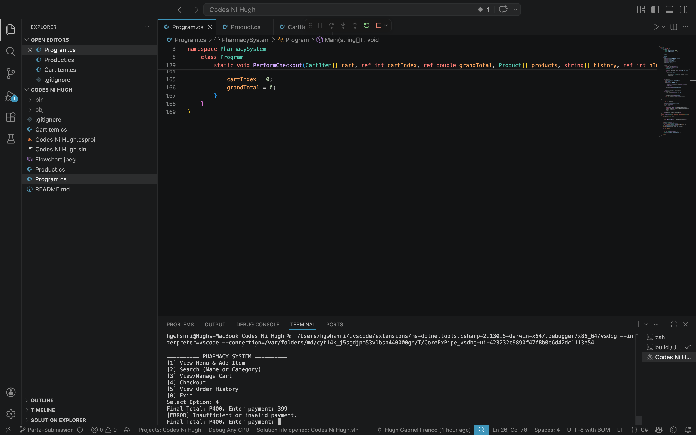
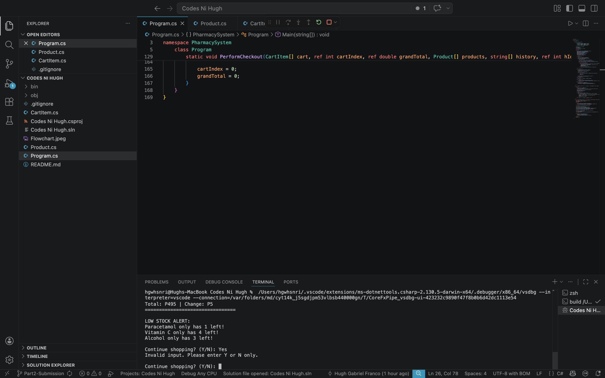

AI usage in this Project

AI was used as a learning and debugging tool to help structure the code and understand specific C# features required for this activity.

1. C# Logic & Concepts

Input Validation: I used AI to understand the difference between int.Parse() and int.TryParse(), ensuring the program doesn't crash if a user enters a letter instead of a number.

Class Organization: AI provided guidance on how to define properties and where to place the Product and CartItem classes in relation to the Main method.

Stock & Duplicate Management: I consulted AI to refine the logic for checking RemainingStock and how to update an existing item in the cart instead of creating a duplicate entry.

Stock Management (2): Used AI to figure out how to link two different data points. When a quantity is added to the CartItem, the AI helped me ensure the RemainingStock inside the Product array is simultaneously deducted. This prevents the system from selling items that are no longer in the drawer.

2. Debugging & Structure

Error Fixing: When I encountered logic errors (like totals not calculating correctly or stock not deducting), I used AI to help identify which line of code was causing the issue.

Code Cleanup: AI helped me simplify my code to make it more readable while still following the Pascal Case naming convention required by the rubric.

3. Setting Up Github

Used AI to set up github and other github related functions needed in this project.

PART 2 OF THE PROJECT

All source code within this repository was authored and implemented independently by the developer. AI (Gemini) was utilized strictly as a Technical Consultant and Conceptual Guide, not as a generative tool for the project’s core logic. The collaboration focused on architectural advice, debugging, and environment configuration.

1. AI USAGE (AI as a Guide)
Conceptual Brainstorming: AI was used to discuss the most efficient ways to structure the inventory search (e.g., whether to use lists or arrays).

Logical Walkthroughs: Instead of generating code, AI provided "pseudo-code" explanations to help the developer understand how to implement the [LOW STOCK ALERT] logic manually.

Error Interpretation: When VS Code flagged namespace or nullable warnings, AI was used to explain the meaning of the errors so the developer could fix them.

Git & Repository: AI provided the specific terminal sequences needed to resolve the .gitignore issues and manage the Part2-Submission branch.

2. Detailed Prompt Log
To ensure full transparency, the following prompts represent how AI was consulted during the development of Part 2:

Logic Guidance: "Can you explain the logic behind filtering a C# list based on a string property? I want to implement a 'Medicine' search for my pharmacy project."

Feature Conceptualization: "I need to flag items with low stock (quantity < 5). What is the best way to integrate a conditional check into my existing console display loop?"

"I want my search to work even if the user types 'medicine' in lowercase. What is the standard C# method for comparing strings regardless of their case?"

Technical Troubleshooting: "I'm seeing a 'CS8618' nullable warning in my Product class. Explain what this means in the context of C# 10.0 and how I should initialize my properties."

Debugging: "What causes a 'pathspec did not match any files' error in Mac terminal?"

Environment Support: "Git is currently ignoring files I need to track. Walk me through the steps to find which line in my .gitignore is causing a global ignore."

Workflow Assistance: "Explain the difference between a standard push and a force push in Git, and when it is appropriate to use it during a project submission."

Once again AI was not used to generate code for the developer but as a tool.

Key Features
*   **Dynamic Product Search**: Users can now filter the inventory by category, making it easier to navigate larger product lists.
*   **Transaction History**: A dedicated logging system that tracks and displays previous purchases during the current session.
*   **Low Stock Alerts**: Items with 5 or fewer units remaining are automatically flagged with a `[LOW STOCK ALERT]` tag in the display.
*   **Exact Change Payment Logic**: The checkout system validates payments; if the amount entered equals the total, it processes the transaction with a zero-balance confirmation.
*   **Input Validation (Y/N)**: Implemented strict error handling for user prompts. The system rejects invalid characters and re-prompts until a valid 'y' or 'n' is entered.

## Functional Proofs

### 1. Product Search by Category

### 2. Transaction History

### 3. Low Stock Alerts

### 4. Checkout and Payment (Exact Change)

### 5. Input Validation (Y/N)

